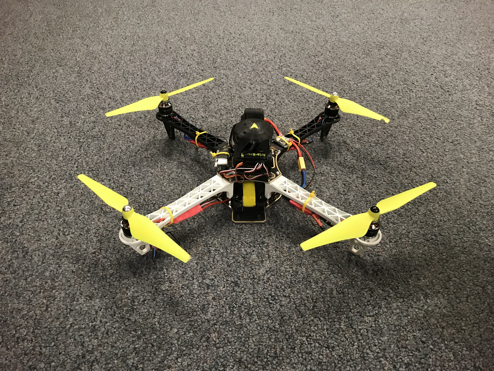
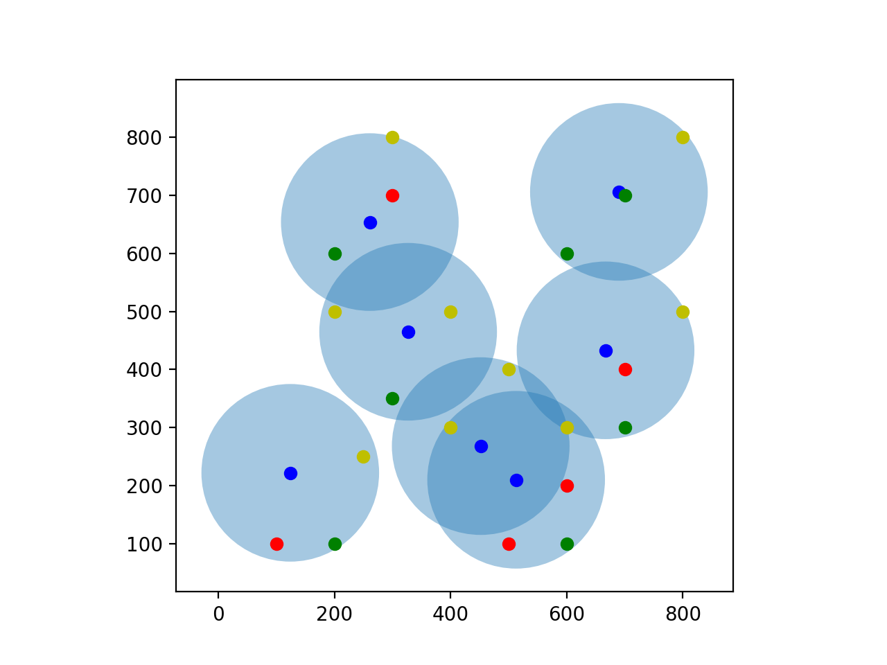

<h1>Drone Swarm Optimizer </h1>

<h2>Overview</h2>

Efficient arrangement of UAVs (Unmanned Aerial Vehicles) in a swarm formation is essential to the functioning of such a swarm as a temporary communication network. Such a network could assist in search-and-rescue efforts by providing first responders with a means of communication. We propose a solution to creating a user-friendly and effective system for calculating and visualizing an optimal layout of UAVs to cover a minimum percentage of overall users in a given area. The calculation is computed by a genetic algorithm while the visualization outputs the results of the calculation in an easy-to-comprehend manner. An initial calculation to gather parameter information is followed by the algorithm that generates the optimal solution. This algorithm is run iteratively until a solution is found. Information is passed between iterations to reduce runtime and complexity.

<table style="width:100%;">
    <tr>
        <th>An example of a UAV for which this algorithm can be run:</th>
        <th>This algorithm will output a visual such as:</th>
    </tr>
    <tr>
        <th></th>
        <th></th>
    </tr>
</table>

In the picture on the left, users are representad as green, yellow, and red dots, in order of increasing density. Blue dots represent UAVs with the lighter blue circles around each UAV being the coverage they can provide. 

This project has been tested using Python 3.7 on Mac OS X Version 10.14.5 and Ubuntu 18.04.

<b>Author:</b> Nicholas Ceccarelli, njceccarelli@gmail.com  
<b>Affiliation:</b> SUNY University at Buffalo: *Student*; University of Nevada, Reno: *REU Participant*

<h2>Installation</h2>

<h3>Dependencies</h3>

<ul>
    <li>Python 3.7</li>
    <li>matplotlib</li>
    <li>numpy</li>
    <li>shapely</li>
</ul>

To install Python, run the following command:

<b>On Linux:</b>

```bash
sudo apt install python3
```

<b>On Mac:</b>

```bash
brew install python3
```

To install the other dependencies, run the command:

```bash
pip3 install matplotlib numpy shapely
```

<h3>Building</h3>

From here on out, "DIR" will represent the path to the directory in which it is desired for the package to be installed, for example "Desktop" or "Desktop/Github_packages".

To download the software, run the following in a terminal window:  

```bash
cd DIR  
git clone https://github.com/nceccarelli/REU_Drone_Swarm_Optimization.git  
cd REU_Drone_Swarm_Optimization
```

Now the software should be downloaded and opened in the terminal window.

<h3>Parameter Definitions</h3>

Before calculation, parameter information needs to be gathered . This can be done by manually changing the values in test_file.py or by GUI prompt in user_file.py. The following informaion needs to be obtained:

<ul>
    <li>min_coverage</li>
    <li>map_density_list</li>
    <li>max_users_per_drone</li>
</ul>

The following table defines the above parameters:

<table style="width:100%;">
    <tr>
        <th>Parameter</th>
        <th>Definition</th>
    </tr>
    <tr>
        <td>min_coverage</td>
        <td>The minimum fraction of users that must be provided network coverage. Reported in the form of a decimal.</td>
    </tr>
    <tr>
        <td>map_density_list</td>
        <td>The map density list - A list of all user clusters in the form of (x, y, number of users).</td>
    </tr>
    <tr>
        <td>max_users_per_drone</td>
        <td>The maximum number of users that can be provided coverage by a single UAV.</td>
    </tr>
</table>

The following parameters pertaining to network calculations may be changed:

<ul>
    <li>wavelength</li>
    <li>directivity_transmitter_dBi</li>
    <li>directivity_reciever_dBi</li>
    <li>power_transmitter_dBm</li>
    <li>power_reciever_dBm</li>
    <li>beamwidth</li>
</ul>

Wavelength is represented in meters, directivities are represented in dBi, powers are represented in dBm, and beamwidth is represented in degrees.

<b><i>All other global variables should not be changed.</b></i>

<h3>Usage</h3>

There are two different ways to use this tool. When the script is run initially, you will be prompted to use the values already in the python script or will be prompted to enter them within the terminal window. Users that wish to run the algorithm multiple times with the same or similar parameters, should manually change the default values within the script and enter "Y". If you are not comfortable with that, "N" should be entered and you will be prompted to enter all necessary information within the terminal session.

<h4>Prompted Information Entry</h4>

You will be prompted for all necessary information within the terminal session. Simply run:

```bash
python3 Drone_Swarm_Optimizer.py
```

When the first question appears, enter "N" (without the quotes).

After this line is run, the terminal window will prompt for parameter input, then display the progress of the algorithm. Once finished, the script will print coordinates of UAV locations, and an external window will open with a visualization of the UAVs and users in map_density_list.

<h4>Manual Information Entry</h4>

In this approach, all variables should be changed within the Python file. The variables that should be changed are concentrated in the beginning of the script.

To do this, open the file in your favorite IDE or open with nano by running the following in the previously described terminal window:

```bash
nano Drone_Swarm_Optimizer.py
```

Once the variables are changed, the script can be run with the command:

```bash
python3 Drone_Swarm_Optimizer.py
```

When the first question appears, enter "Y" (without the quotes).

After this line is run, the terminal window will display the progress of the algorithm. Once finished, the script will print coordinates of UAV locations, and an external window will open with a visualization of the UAVs and users in map_density_list.
